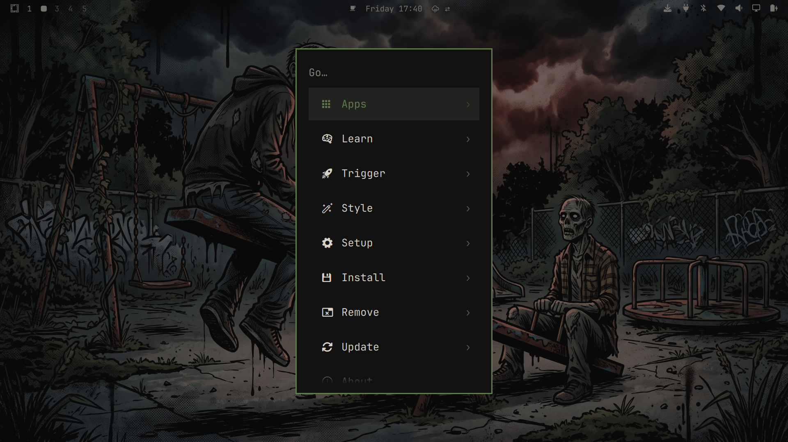
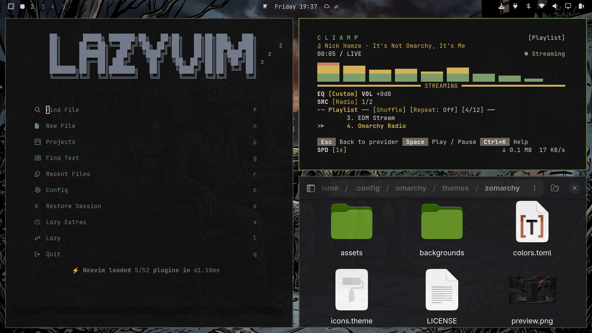
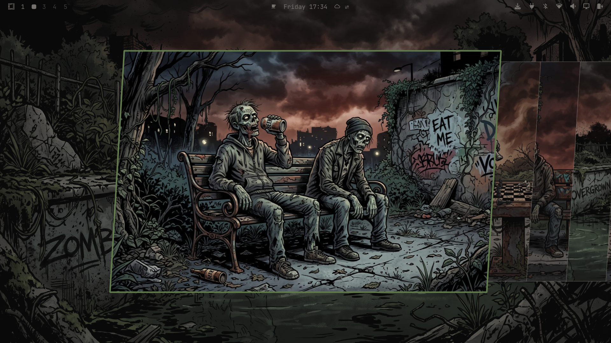
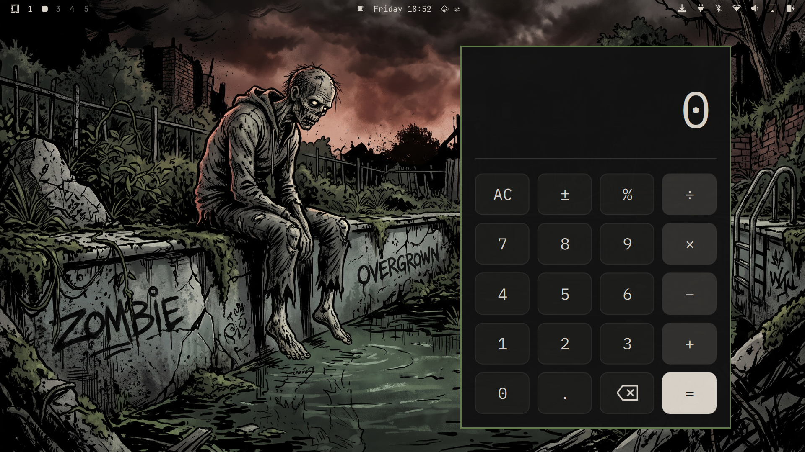
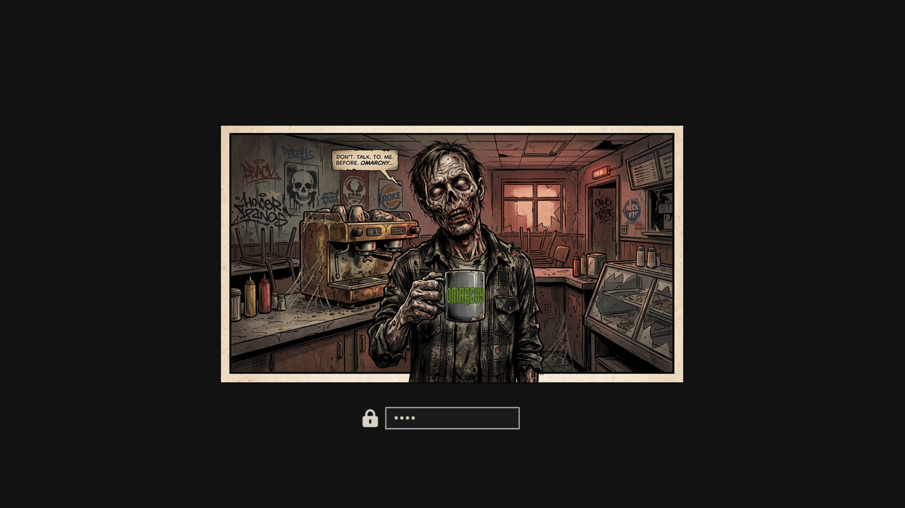
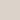
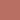
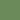

# Zomarchy

[](https://github.com/tcballard/omarchy-badges)

> A dark, humorous comic book zombie theme for [Omarchy](https://omarchy.org/) —
> a handful of decaying undead, frozen mid-gesture in their 
> past routines. Bold ink lines, gritty textures and muted
> charcoal-and-olive tones, with a single warm reddish-brown glow bleeding
> through the night sky. The decay is quiet. The humor is not.

## Preview



## Screenshots









## Installation

Install the theme either way:

**Via the Omarchy menu:** open the launcher (`Super` + `Space`), go to
**Install → Style → Theme**, and enter the GitHub link:

```
https://github.com/nico-m-dev/omarchy-zomarchy-theme.git
```

**Or via the command line:**

```bash
omarchy theme install https://github.com/nico-m-dev/omarchy-zomarchy-theme.git
```

Then apply it:

```bash
omarchy theme set zomarchy
```

## Uninstalling

Themes you install appear under `~/.config/omarchy/themes/`. To remove this
one:

```bash
rm -rf ~/.config/omarchy/themes/zomarchy
```

Then switch back to another theme (e.g. `omarchy theme set tokyo-night`).

**Via the Omarchy menu:** open the launcher (`Super` + `Space`), go to **Remove → Theme**

## Backgrounds

Nine original ultrawide (21:9) wallpapers and a unique boot screen, all in the same American comic book
horror style — muted charcoal and olive tones with a
single reddish-brown glow as the only warm accent — composed so the artwork
also looks great on 16:9 screens:

| File                | Subject                                   |
| ------------------- | ----------------------------------------- |
| `01-parkbench.jpg`  | Two zombies hanging out on a park bench   |
| `02-chess.jpg`      | Two zombies at a rusted chess table       |
| `03-busstop.jpg`    | Two zombies waiting at a bus stop         |
| `04-pool.jpg`       | A zombie by an overgrown swimming pool    |
| `05-seesaw.jpg`     | Two zombies on a half-rusted seesaw       |
| `06-newspaper.jpg`  | A zombie trying to read a tattered paper  |
| `07-selfie.jpg`     | Two zombies attempting a selfie           |
| `08-swing.jpg`      | A zombie endlessly swinging               |
| `09-foodtruck.jpg`  | Two zombies in line at a food truck       |

## Color palette

A dark, muted palette — mossy olive and warm earthy hues on a near-black
ground, with the reddish-brown glow of the backgrounds echoed in the semantic
colors. Nothing is fresh; everything is reclaimed.

| Role   | Color    | Swatch                              |
| ------ | -------- | ----------------------------------- |
| Accent | `#617B4C`|  |
| Text   | `#D8D2C8`|  |
| Bg     | `#121212`|  |
| Red    | `#B86F63`|  |
| Green  | `#6B8A5A`|  |
| Blue   | `#767E8E`|  |

## License

[MIT](LICENSE)